## 1.  KẾT QUẢ THỰC NGHIỆM
Bảng dưới đây trình bày kết quả trên tập **Test** cho 5 cấu hình thí nghiệm. Các độ đo bao gồm Accuracy, Precision, Recall, và F1-Score (macro).

| Thí nghiệm | Cấu hình & Regularization | Accuracy | Precision | Recall | F1-Score |
| :--- | :--- | :---: | :---: | :---: | :---: |
| **Exp-0**  | Baseline (Adam, No Reg) | *0.8209* | *0.8217* | *0.8211* | *0,8208* |
| **Exp-0**  | Baseline (SGD, No Reg) | *0.7229* | *0.7241* | *0.7232* | *0.7227* |
| **Exp-1**  | L2 / Weight Decay (1e-3) | *0.8293* | *0.8293* | *0.8293* | *0.8293* |
| **Exp-2**  | Dropout (p=0.5) | *0.8313* | *0.8318* | *0.8314* | *0.8312* |
| **Exp-3**  | Data Augmentation | *0.8625* | *0.8626* | *0.8624* | *0.8624* |
| **Exp-4**  | Early Stopping + Full Reg | *0.9004* | *0.9005* | *0.9004* | *0.9004* |

---

## 2. PHÂN TÍCH VÀ NHẬN XÉT (OVERFIT / UNDERFIT)

Dựa trên đồ thị Train/Val Loss và Accuracy, rút ra các nhận xét sau:

### Exp-0: Baseline (Adam, Không Regularization)
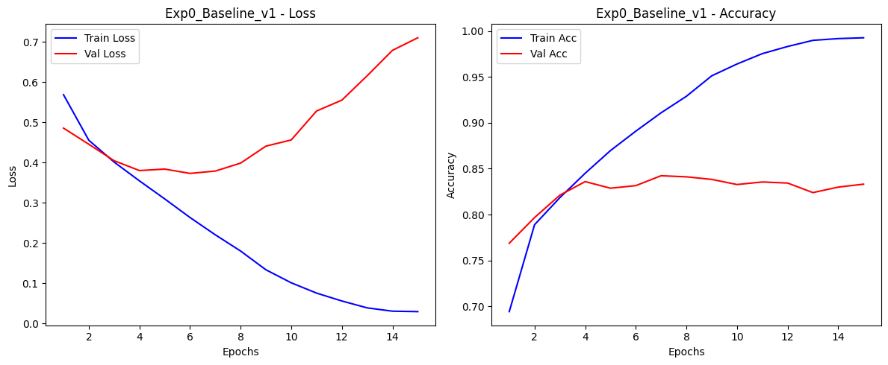
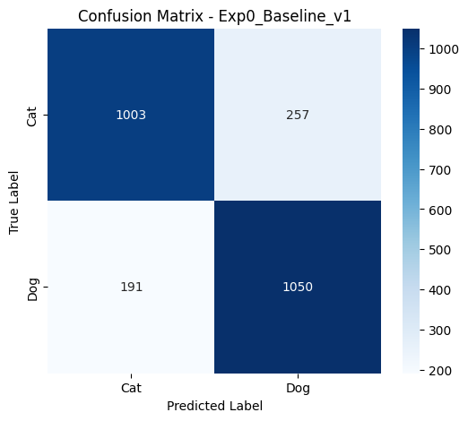
- **Nhận xét:** Mô hình nhanh chóng đạt Accuracy rất cao trên tập Train (gần 100%), nhưng Val Loss bắt đầu tăng mạnh sau một vài epoch đầu. 
- **Kết luận:** Xảy ra hiện tượng **Overfitting**. Mô hình "học vẹt" tập huấn luyện và mất khả năng tổng quát hóa trên dữ liệu mới.

### Exp-0: Baseline (SGD, Không Regularization)
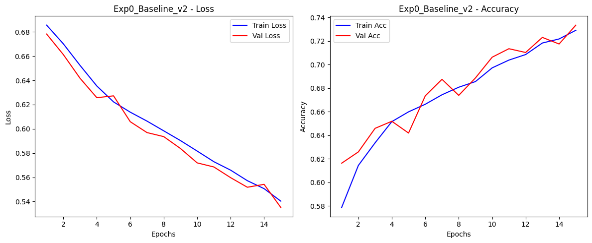
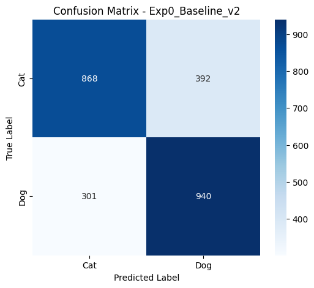
- **Nhận xét:** Mô hình nhanh chóng đạt Accuracy rất cao trên tập Train (gần 100%), nhưng Val Loss tăng nhưng không ổn định.
- **Kết luận:** Xảy ra hiện tượng **Overfitting** trầm trọng. 

### Exp-1: Weight Decay (L2 Penalty)
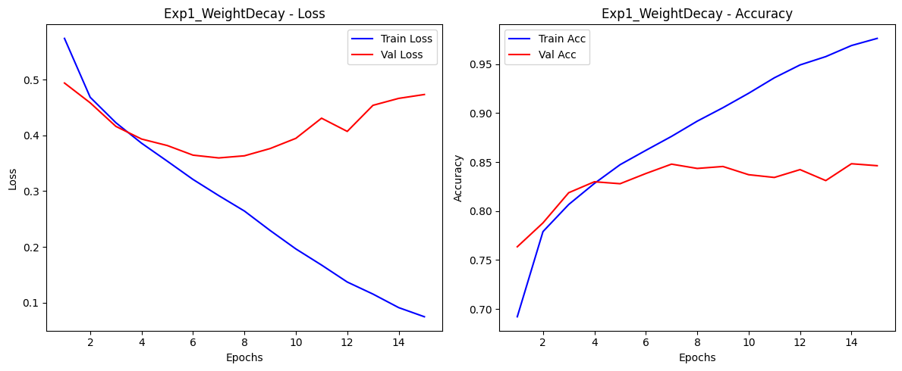
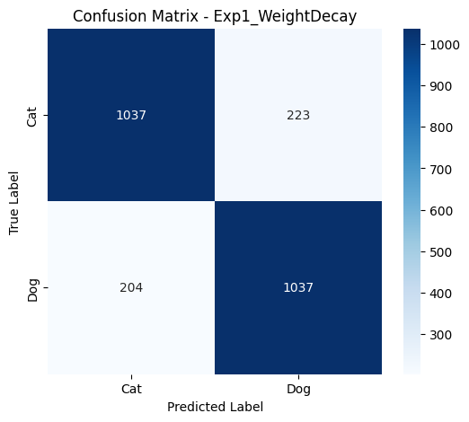
- **Nhận xét:** So với Baseline, Val Loss tăng chậm hơn. Train loss giảm nhưng Val loss có dấu hiệu tăng.
- **Kết luận:** L2 Regularization đã ép các trọng số (weights) nhỏ lại, phần nào giảm bớt mức độ phức tạp của mô hình, giúp giảm Overfitting nhẹ. Tuy nhiên, nếu set Weight Decay quá lớn có thể dẫn đến **Underfitting**.

### Exp-2: Dropout (p=0.5)
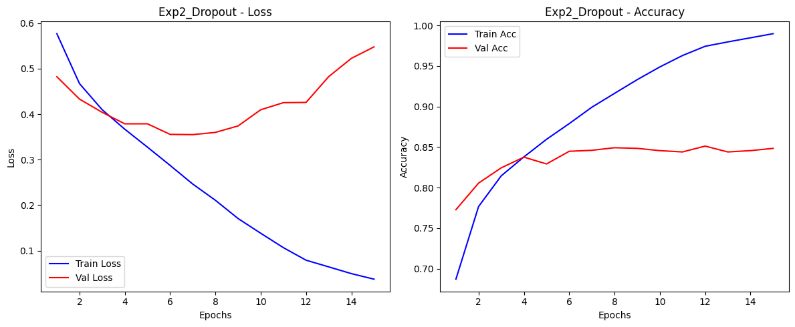
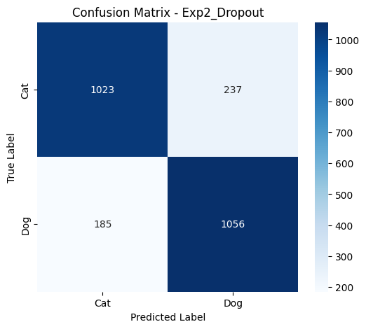
- **Nhận xét:** Đồ thị Train Loss giảm, val loss giảm rồi lại tăng. Val Accuracy duy trì mức ổn định.
- **Kết luận:** Bằng cách tắt ngẫu nhiên 50% neuron trong các epoch huấn luyện, Dropout ép mô hình phải học các đặc trưng (features) đa dạng hơn từ ảnh. Đây là phương pháp giảm Overfitting rất hiệu quả đối với Fully Connected layers.

### Exp-3: Data Augmentation
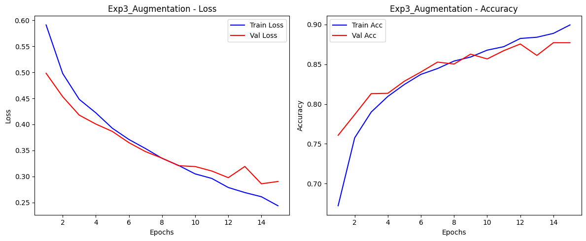
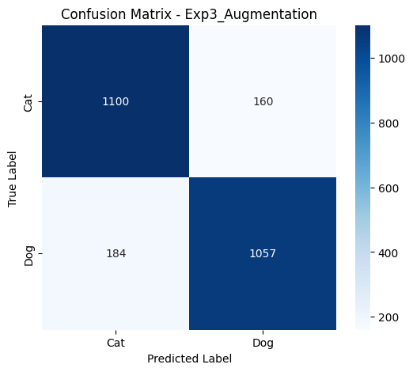
- **Nhận xét:** Train Accuracy thấp hơn các thí nghiệm trước (do dữ liệu liên tục bị biến đổi: lật, xoay, thay đổi màu sắc). Tuy nhiên, Val Loss và Train Loss đi sát nhau nhất.
- **Kết luận:** Data Augmentation giải quyết tận gốc nguyên nhân của Overfitting (thiếu dữ liệu). Mô hình học được các bất biến (invariance) của vật thể, đem lại kết quả tốt nhất trên tập Test.

### Exp-4: Early Stopping (Kết hợp)
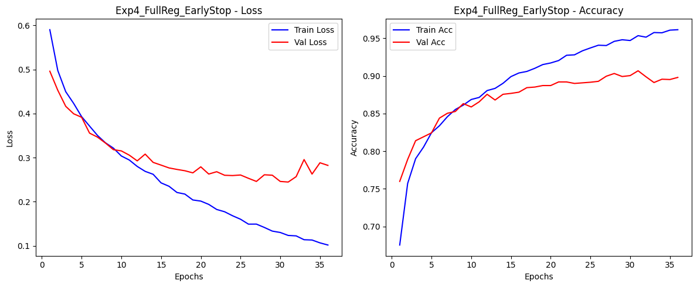

- **Nhận xét:** Quá trình huấn luyện dừng sớm ở epoch số `36` khi Val Loss không cải thiện trong 5 epoch liên tiếp (patience = 5).
- **Kết luận:** Early stopping giúp tiết kiệm thời gian tính toán và bắt được điểm checkpoint có Val Loss thấp nhất trước khi mô hình bắt đầu Overfit.

